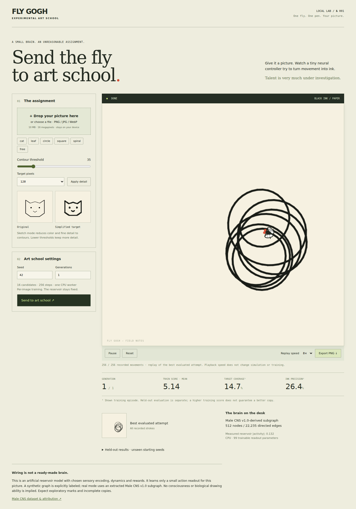

# Fly Gogh — Fly_paint

**A tiny connectome-derived controller, one pen, and your picture.**

Upload a PNG, JPEG or WebP, preview its contours, and train a virtual fly to
attempt a sketch through bounded movement. This is a runnable local research
prototype with real readout learning. Drawings remain exploratory scribbles
and partial contours; it does **not** yet reliably reproduce recognizable images.



## Start on MacBook M1 / 32 GB

Use native ARM64 Python **3.12**, Node **22 LTS** (22.12+), and npm. The locked
binary packages were downloaded successfully for **macOS 14+ ARM64**. Actual
execution and performance were tested on Linux x86_64, not on an M1 machine.
Do not use a Rosetta/x86 Python for the native ARM64 setup.

```bash
git clone https://github.com/DanilAntyp/Fly_paint.git
cd Fly_paint
bash scripts/setup.sh
bash scripts/run.sh
```

Open **http://127.0.0.1:8000**. This first command uses the explicitly labeled
**Synthetic demo graph** (512 nodes). Upload your picture or try `cat`, choose
a seed and generation budget, then select **Send to art school**. Pause stops
both optimization and stroke replay; reset cancels the run and preserves the
seed for the next start. Replay speed changes playback only. PNG exports the
current drawing alone. The original, simplified target, best attempt, scores
and held-out results are visible separately. `free` is untrained exploration.

## Use the real Male CNS data

The raw download is about 1.07 GB; leave several GB of free disk space.
Downloads and processed graphs stay outside Git. No login, token or payment is
needed. Stop the running server with Ctrl+C before changing graph mode.

```bash
.venv/bin/python scripts/download_data.py
.venv/bin/python scripts/inspect_data.py data/raw/*.feather
OPENBLAS_NUM_THREADS=1 .venv/bin/python scripts/extract_task_graph.py
bash scripts/run.sh data/processed/task-512
```

This explicitly shows **Male CNS v1.0-derived subgraph**: 512 nodes and 22,235
actual directed edges for the recorded release. Load errors remain errors;
there is no silent synthetic fallback. Exact source URLs, hashes, observed
schema and extraction counts are in [docs/DATA.md](docs/DATA.md) and
[docs/EXTRACTION.json](docs/EXTRACTION.json).

## Train without the browser

```bash
bash scripts/train-m1.sh --graph data/processed/task-512 \
  --image data/demo/cat.png --generations 10 --output runs/my-cat.npz
```

Omit `--graph` for the synthetic baseline. Use `--image /path/to/picture.png` for
your own image; without it, `--preset cat` is the default. Available controls
include `--size 64|128|256`, `--threshold`, `--seed`, `--steps` and
`--population`. Defaults: one CPU worker, 512 neurons, 99 learned parameters,
16 candidates, 10 generations and 256-step episodes. W is fixed. Checkpoints
and metrics are saved to ignored `runs/`; they are not bundled pretrained models.

## What was actually measured

Both official data files were downloaded and validated. Three independent
10-generation runs used the real task subgraph and three used a matched
random graph. On the cat image, real-graph training seed 42 improved held-out
score from **−8.40 to +4.72**, with **12.3% target coverage**. Seeds 43 and 44
were weaker; seed 44 underperformed random actions. Across all three seeds,
mean coverage was only **5.8%**. These are small experiments, not a claim of
reliable image copying or biological superiority.

The 512/1024/2048-node graphs ran at approximately 0.19/0.26/0.38 ms per complete
CPU simulation step in this Linux environment. Individual inference processes
peaked at 47–54 MiB; data extraction peaked around 1.4 GiB. These are **not M1
benchmarks**. See [results and failure cases](docs/RESULTS.md),
[hardware notes](docs/HARDWARE.md), and [methodology](docs/METHODOLOGY.md).

Ablation tested four annotated groups and six pairs on frozen checkpoints and
held-out starts/targets. No removal met the conservative 5% quality-loss rule
across all cases. The application therefore retains the 512-node subgraph.
Masking neurons is not presented as a memory optimization.

## Verify / develop

```bash
OPENBLAS_NUM_THREADS=1 .venv/bin/python -m unittest discover -s tests -v
.venv/bin/python -m compileall -q src scripts services tests
npm run build --prefix apps/web
npx --prefix apps/web playwright install chromium
npm test --prefix apps/web
```

The browser tests start the local API themselves. To exercise real mode:
`FLYPAINT_GRAPH=data/processed/task-512 npm test --prefix apps/web`.
For UI development, run the API plus `npm run dev --prefix apps/web` in a
second terminal. The Vite proxy forwards `/api` and WebSockets locally.

- `src/flypaint`: target processing, graph, reservoir, physics and learning.
- `services/trainer`: local API, jobs, WebSockets and PNG export.
- `apps/web`: React/TypeScript/Canvas UI; no external image services or fonts.
- `scripts`: download, inspect, extract, train, measure and ablate.
- `docs`: recorded provenance, evidence and optimization decisions.

## Limits and attribution

This is an artificial model, not the entire fly brain. Chosen sensory encoding,
nonnegative normalized weights, dynamics and readout are engineering assumptions.
Image copying is per-image adaptation; zero-shot copying, robust portrait
reconstruction, full-color painting, SVG export, PPO and MPS are not implemented.
No real M1 timing or biological fidelity is claimed.

Male CNS v1.0 data: FlyEM at HHMI Janelia, University of Cambridge, MRC Laboratory
of Molecular Biology and Google Research, under
[CC BY 4.0](https://creativecommons.org/licenses/by/4.0/).
See the [official project and publication](https://www.janelia.org/project-team/flyem/male-cns-connectome)
and [downloads](https://male-cns.janelia.org/download/).
Modifications here: annotation filtering, directed-path selection, induced
subgraph extraction and incoming-count normalization. Dataset licensing does
not imply a license has been assigned to this repository's code.
