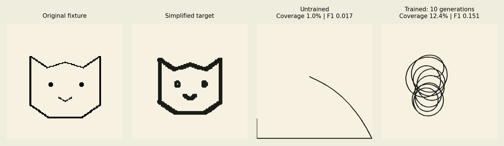

# Observed prototype results — 2026-09-12

Linux x86_64, Python 3.12.14; **not measured on an M1**. Source data was
downloaded successfully. Training, API and browser all executed. Image
copying remains weak: these are attempts, not reliable reconstructions.

## Per-image learning

Procedural cat image, 128×128 target, two training starts, three held-out
starts per checkpoint; 16 candidates × 10 generations × 256 steps.
Three independent initializations (42/43/44) for each graph. Evaluation
seed windows overlap across checkpoints, so rows are not nine independent
images or fully independent evaluation starts. All checkpoints are shown.

| Graph | Training seed | Initial train score | Final train score | Untrained held-out | Trained held-out | Random actions | Trained coverage | Trained F1 |
|---|---:|---:|---:|---:|---:|---:|---:|---:|
| real | 42 | -7.23 | 8.69 | -8.40 | 4.72 | -3.79 | 12.3% | 0.152 |
| real | 43 | 2.54 | 5.89 | -6.86 | 2.13 | -3.38 | 3.2% | 0.053 |
| real | 44 | -8.03 | 1.17 | -8.91 | -4.10 | -1.21 | 1.8% | 0.034 |
| random | 42 | -8.55 | 7.33 | -9.65 | -2.01 | -3.79 | 5.0% | 0.070 |
| random | 43 | -3.59 | 7.48 | -8.41 | -2.98 | -3.38 | 5.2% | 0.068 |
| random | 44 | -8.13 | 13.07 | -9.19 | -1.42 | -1.21 | 7.3% | 0.091 |

Real seed 42 improves, but real seed 44 underperforms random actions on the
held-out starts. Real seed 43 improves score while losing a little coverage.
The objective can favor fewer penalties over coverage. There is no strong
evidence of a real-connectome advantage over the matched random graph.
The random control matches nodes, edge count and sensory/output adapters;
it does not preserve degrees, connection-weight distributions or cell types.

These are per-image adaptations; no arbitrary-image zero-shot success is
claimed. Leaf and circle are held-out target fixtures in the frozen-model
ablation, not additional training targets. A portrait dataset was not tested.



The comparison uses held-out start 1042 of checkpoint 42. All visible ink
comes from bounded controller movements. The untrained and trained images
are incomplete; no tracing teacher or image-generation output is used.

## Group ablation

27 paired episodes per mask: 3 independently trained checkpoints × 3 targets
(adapted cat, held-out leaf, held-out circle) × 3 held-out starts. The four
groups contain 67 visual_projection, 270 CX, 158 descending_neuron and
17 vnc_motor nodes. All six pairs were also tested. Weights, normalization
and readouts stayed frozen. See [raw rows](ABLATION.json).

| Disabled group | Mean F1 | Mean coverage | Mean off-target pixels | Mean task score | Mean step ms | All paired losses ≤5%? |
|---|---:|---:|---:|---:|---:|---|
| intact | 0.0736 | 5.07% | 249.0 | -1.62 | 0.194 | control |
| descending_neuron | 0.0134 | 0.71% | 33.0 | -9.77 | 0.184 | False |
| visual_projection | 0.0225 | 1.28% | 51.1 | -7.56 | 0.188 | False |
| CX | 0.0757 | 5.16% | 237.9 | -1.33 | 0.216 | False |
| vnc_motor | 0.0930 | 6.37% | 267.2 | -2.64 | 0.211 | False |
| descending_neuron+visual_projection | 0.0134 | 0.71% | 33.0 | -9.77 | 0.199 | False |
| descending_neuron+CX | 0.0134 | 0.71% | 33.0 | -9.77 | 0.203 | False |
| descending_neuron+vnc_motor | 0.0223 | 1.18% | 48.0 | -15.53 | 0.224 | False |
| visual_projection+CX | 0.0226 | 1.29% | 52.0 | -7.54 | 0.186 | False |
| visual_projection+vnc_motor | 0.0111 | 0.60% | 37.0 | -8.87 | 0.197 | False |
| CX+vnc_motor | 0.0945 | 6.44% | 258.8 | -2.52 | 0.212 | False |

Some mean metrics improve after masking CX or motor nodes, but individual
paired cases fail the predeclared threshold. **No additional pruning is
justified or deployed.** A mask retains the same sparse allocation and is
not a memory optimization. Peak RSS for the complete ablation process was
49.7 MiB; per-group memory savings were not measured.

## Cost and graph sizes

| Nodes | Edges | Full CPU step | Process peak RSS |
|---:|---:|---:|---:|
| 512 | 22,235 | 0.193 ms | 47.0 MiB |
| 1024 | 87,149 | 0.265 ms | 48.8 MiB |
| 2048 | 234,095 | 0.382 ms | 53.5 MiB |

The timings include observations, reservoir, motion and rasterization, not
optimization or browser rendering. Larger graphs have not been trained for
quality comparison. Source extraction used around 1.4 GiB peak RSS. Synthetic
512-node reservoir-only timing was 58,149 steps/s at 42.1 MiB; this narrower
benchmark is not training throughput. Some timings occurred alongside other
validation work and are observational, not isolated hardware certification.

## Verification actually run

- Fresh Python 3.12 virtual environment installation from requirements-lock.txt.
- 16 unittest tests: graph orientation/IDs/weights, image formats/limits/EXIF/alpha,
  aspect ratio, blank targets, reward exploits, bounds, reproducible learning,
  masks, directed extraction, endpoint adapters, pause/cancel, replacement,
  WebSocket completion and PNG export.
- compileall on src, scripts, services and tests.
- TypeScript noEmit check and production Vite build.
- Two Chromium Playwright scenarios on the real task graph: full image flow,
  progressive ink, pause, completed training, PNG download, reset/replacement,
  invalid/blank images, detail changes and a 390-pixel mobile viewport.
- Successful download of all locked ARM64/universal wheels for Python 3.12
  on macOS 14+. Native M1 execution, battery use and thermals remain untested.

CI runs synthetic mode without downloading the 1 GB source dataset. Real-mode
evidence here comes from local verification, not an asserted CI result.

## Reproduce experiments

```bash
OPENBLAS_NUM_THREADS=1 .venv/bin/python scripts/run_experiments.py \
  --graph data/processed/task-512
OPENBLAS_NUM_THREADS=1 .venv/bin/python scripts/evaluate_ablation.py \
  --graph data/processed/task-512 \
  --checkpoints runs/real-cat-42.npz runs/real-cat-43.npz runs/real-cat-44.npz
OPENBLAS_NUM_THREADS=1 .venv/bin/python scripts/extract_task_graph.py \
  --nodes 1024 --output data/processed/task-1024
OPENBLAS_NUM_THREADS=1 .venv/bin/python scripts/extract_task_graph.py \
  --nodes 2048 --output data/processed/task-2048
OPENBLAS_NUM_THREADS=1 .venv/bin/python scripts/measure.py --graph data/processed/task-512
```

Next quality work should improve exploration and test broader image/starting
pose curricula. More generations alone can overfit. Revisit pruning only
after the intact controller reaches useful drawing quality.
